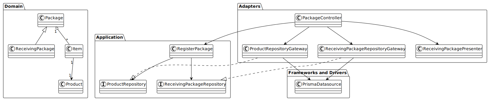

# NGO System

[](https://nestjs.com/)
[](https://www.typescriptlang.org/)
[](https://www.prisma.io/)
[](https://www.postgresql.org/)
[](https://www.docker.com/)
[](https://jestjs.io/)

Projeto desenvolvido referente ao desafio da disciplina de clean architecture da segunda fase da postech em Software Architecture - FIAP


O diagrama acima segue os princípios da Clean Architecture, separando o domínio de negócio (Entidades) das camadas de aplicação (Casos de Uso), adaptação (Interface Adapters) e infraestrutura (Frameworks and Drivers).
## ✅ Pré-requisitos

Antes de começar, certifique-se de ter instalado em sua máquina:

- [Docker](https://www.docker.com/)
- [Docker Compose](https://docs.docker.com/compose/)

## ⚙️ Configuração do Ambiente

1. Clone o repositório para sua máquina local.
2. Navegue até a pasta do projeto.
3. Crie um arquivo `.env` na raiz do projeto baseado no arquivo `.env.example`:

   ```bash
   cp .env.example .env
   ```

4. Abra o arquivo .env e preencha as variáveis de ambiente com os valores apropriados para o seu ambiente.

## 📝 Licença

Este projeto está licenciado sob a [MIT License](./LICENSE).

## 👨‍💻 Autor

**Douglas Vinicius Caldas Bonin**

- [GitHub](https://github.com/dviniciusbonin)
- [LinkedIn](https://www.linkedin.com/in/dviniciusbonin)
<!-- - [Portfólio](https://seusite.com) -->
